<div align="center">

# > FRANCISCO.NHZ_

### FRONT-END DEVELOPER · WEB DEVELOPER · NHZ WEBSOLUTIONS


<br>


</div>

<br>

---

## `> SYSTEM.INIT()`

```text
[ OK ] System initialized
[ OK ] Developer profile loaded
[ OK ] Front-End environment online
[ OK ] NHZ WebSolutions initialized

STATUS  :: ONLINE
FOCUS   :: FRONT-END DEVELOPMENT
MODE    :: LEARNING / BUILDING / EVOLVING
```

---

## `> ABOUT_ME`

I'm **Francisco**, a Front-End Developer focused on building modern,
responsive and functional web experiences.

Currently deepening my knowledge of **JavaScript**, while turning what I
learn into real projects, improving my architecture, code organization
and development workflow.

My goal is simple:

> **Learn → Build → Improve → Ship.**

I'm also building **NHZ WebSolutions**, turning my development journey
into something bigger than individual projects.

---

## `> TECH_STACK`

<div align="center">

### Front-End


### Tools & Workflow


### Technologies & Libraries


</div>

---

## `> CURRENT_MISSION`

```text
┌─────────────────────────────────────────────┐
│              NHZ DEVELOPMENT CORE           │
├─────────────────────────────────────────────┤
│                                             │
│  [✓] HTML                                   │
│  [✓] CSS                                    │
│  [✓] Git / GitHub                           │
│  [→] JavaScript                             │
│  [→] Front-End Architecture                 │
│  [→] Real-world Projects                    │
│  [ ] NHZ WebSolutions                       │
│  [ ] International Career                   │
│                                             │
└─────────────────────────────────────────────┘
```

---

## `> PROJECTS`

<div align="center">

### 🛍️ CHARMÊ BOUTIQUE 2.0

**Modern e-commerce front-end**

`HTML` · `CSS` · `JavaScript` · `Git` · `GitHub Pages`

A complete front-end project focused on product browsing,
filtering, shopping cart interactions, responsive design
and modular code organization.

<br>

<a href="https://github.com/Francisco-NHZ/charme-boutique">

</a>

<a href="https://francisco-nhz.github.io/charme-boutique/">

</a>

</div>

<br>

<div align="center">

### 💰 FINANÇAS DA CASA

**Personal finance management application**

`JavaScript` · `Tailwind CSS` · `Chart.js` · `Firebase Firestore`

A project focused on practical financial organization,
data visualization and application logic.

</div>

---

## `> GITHUB_ANALYTICS`

<div align="center">

<a href="https://github.com/Francisco-NHZ">
  
</a>

<a href="https://github.com/Francisco-NHZ">
  
</a>

<br><br>


<br><br>


</div>

---

## `> ACHIEVEMENTS`

<div align="center">



</div>

---

## `> SYSTEM STATUS`

<div align="center">


<br><br>

**Learning. Building. Evolving.**

</div>
